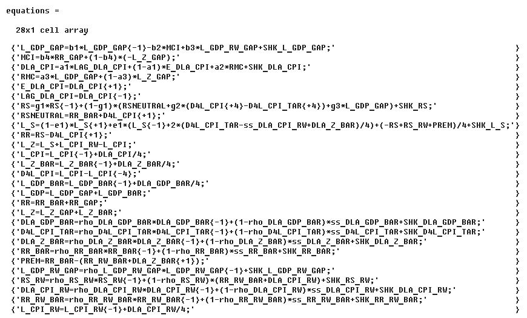

# From_model_to_sankey
Prepares MATLAB IRIS model for drawing Sankey Network Diagram.
For seeing the diagram go to https://rpubs.com/Shahzod1011/649343

### BEFORE

### AFTER  *(names of variables in the equatians have been replaced by their descriptions)*

